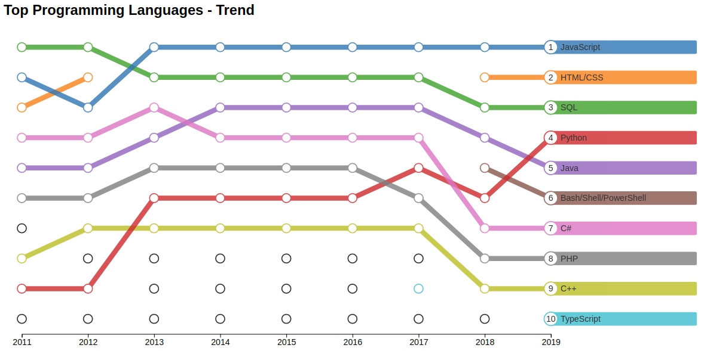

# Create a Rank Chart
This project creates an interactive rank chart

## Table of Contents
<ol>
   <li><a href="#head1"> Description of the project</a>
   <li><a href="#head2"> Libraries used </a>
   <li><a href="#head3"> Directory structure </a>
   <li><a href="#head4"> Usage </a>
   <li><a href="#head5"> Author </a>
</ol>


<h2 id="head1"> Description of the project </h2>
Given JSON array of object with the following properties, it creates an interactive rank chart:
<ul>
   <li>Year
   <li>Name
   <li>Rank
   <li>Value
</ul>

<h2 id="head2"> Libraries used </h2>

<ul>
 <li> d3.js
</ul>

<h2 id="head3"> Directory structure </h2>

```
.
├── data                                                    # Folder to hold data files
    ├── data.csv                                            # Data in CSV format
    ├── data.js                                             # Data in JSON format
├── js                                                      # Folder to hold JS files
    ├── d3-v4.js                                            # d3 v4 file
    ├── RankChart.js                                        # Main JS code for rank chart creation
├── index.html                                              # Index HTML file
├── README.md                                               # ReadMe file

```

<h2 id="head4"> Usage </h2>

In the HTML page:
1. Include d3.js file
2. Include RankChart.js file
3. Invoke the RankChart method, passing in the d3 selection of div element to hold the chart, data array, and title. The objects in data array must have the 'Year', 'Rank', and 'Name' attributes. 'Value' attribute is optional.

Below is sample invocation and corresponding chart.

`RankChart(d3.select('#chart'), data, "Top Programming Languages - Trend");`



<h2 id="head5"> Author </h2>

[Shahzeb Akhtar](https://www.linkedin.com/in/shahzebakhtar/)
